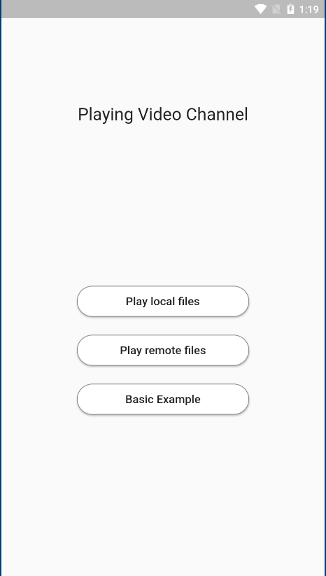
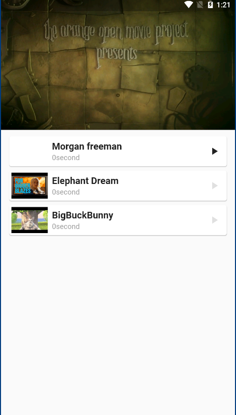

#  🔥🔥  Video Channel
![appicon]

## Getting Started

This project is a example for a Flutter application.

Star⭐ the repo if you like what you see😉.

## ✨ Requirements
* Any Operating System (ie. MacOS X, Linux, Windows)
* Any IDE with Flutter SDK installed (ie. IntelliJ, Android Studio, VSCode etc)
* A little knowledge of Dart and Flutter
* A brain to think 🤓🤓

## Screenshots

 
 

## Installation

#### 1. [Setup Flutter](https://flutter.dev/docs/get-started/install)

#### 2. Clone the repo

#### 3. Setup Those
* [path_provider](https://pub.dev/packages/path_provider)
* [video_player](https://pub.dev/packages/video_player)
* [screen](https://pub.dev/packages/screen)

## 🤓 Author(s)
**Ayoub Ghoudan